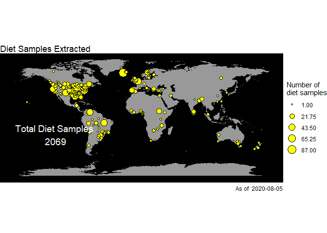

Freswater Fish Diet Database
================
Jacob Ridgway, Justin Pomeranz, Jeff Wesner
5/7/2020

University of South Dakota Department of Biology

# Purpose

To create an open source global database of freshwater fish diet
samples.

# Approach

We are compiling and digitizing diet data from \> 130 years of
scientific literature. *Expected completion \~ Spring 2022*

<!-- -->
